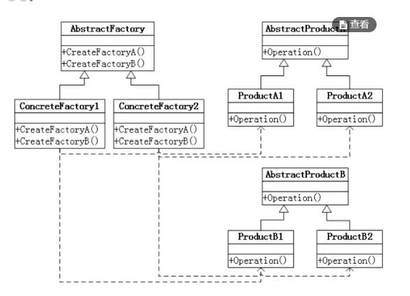
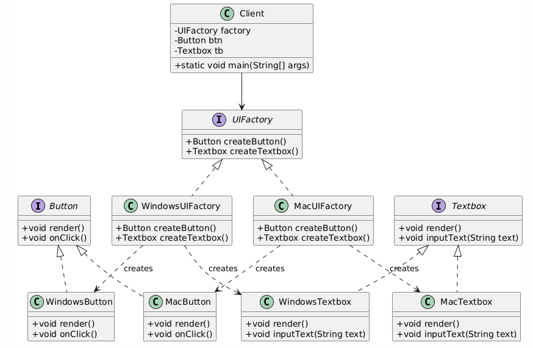
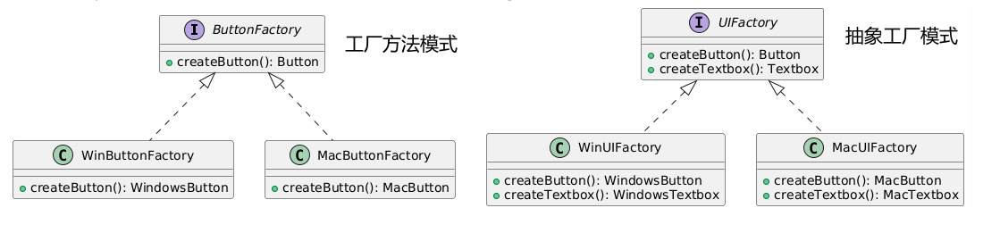
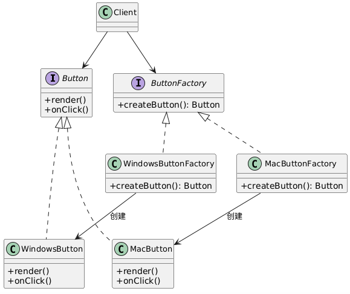

## 抽象工厂模式

需求：

假设需要开发一个跨平台的GUI库，支持**Windows**和**MacOS**两种操作系统。每个系统需要提供：

- **按钮**（Button）：不同系统的按钮样式和点击逻辑不同
- **文本框**（Textbox）：不同系统的输入框渲染方式不同

~~~java
//================== 抽象产品层 ==================
// 抽象按钮接口
interface Button {
    void render();
    void onClick();
}

// 抽象文本框接口
interface Textbox {
    void render();
    void inputText(String text);
}

//================== 具体产品层 ==================
// Windows风格按钮
class WindowsButton implements Button {
    public void render() { System.out.println("Windows风格按钮渲染"); }
    public void onClick() { System.out.println("Windows按钮点击特效"); }
}

// Mac风格按钮
class MacButton implements Button {
    public void render() { System.out.println("Mac风格圆角按钮渲染"); }
    public void onClick() { System.out.println("Mac按钮动态缩放特效"); }
}

// Windows风格文本框
class WindowsTextbox implements Textbox {
    public void render() { System.out.println("Windows单线边框文本框"); }
    public void inputText(String text) { System.out.println("Windows输入：" + text); }
}

// Mac风格文本框
class MacTextbox implements Textbox {
    public void render() { System.out.println("Mac毛玻璃效果文本框"); }
    public void inputText(String text) { System.out.println("Mac输入动画：" + text); }
}
//================== 抽象产品end... ==================
//================== 抽象工厂层start... ==================
interface UIFactory {//
    Button createButton();
    Textbox createTextbox();
}

//================== 具体工厂层 ==================
class WindowsUIFactory implements UIFactory {
    public Button createButton() { return new WindowsButton(); }
    public Textbox createTextbox() { return new WindowsTextbox(); }
}

class MacUIFactory implements UIFactory {
    public Button createButton() { return new MacButton(); }
    public Textbox createTextbox() { return new MacTextbox(); }
}
~~~

对抽象工厂类图的解释：

AbstractFactory是抽象工厂，一般是一个接口，有两个实现类，这两个实现类是具体的工厂，一个是win工厂，一个是mac工厂

win工厂专门用来生产win相关的产品 （注意，这里的产品也是由接口定义好，然后win产品实现接口，来实现自己的方法。）

mac工厂专门用来生产mac相关的产品

我们在客户端使用产品时，只需要根据抽象工厂调用就可以了

~~~java
//================== 客户端代码 ==================
public class Client {
    public static void main(String[] args) {
        // 动态选择工厂（可通过配置或运行时判断）
        UIFactory factory;
        if (System.getProperty("os.name").contains("Windows")) {
            factory = new WindowsUIFactory();
        } else {
            factory = new MacUIFactory();
        }

        // 使用抽象接口创建组件
        Button btn = factory.createButton();
        Textbox tb = factory.createTextbox();

        // 渲染组件
        btn.render();
        tb.render();
        
        // 交互操作
        btn.onClick();
        tb.inputText("Hello Abstract Factory!");
    }
}
~~~

根据这个图片，我们发现，如果需要拓展linux平台，只需要再增加一个linuxFactory工厂类就可以了，对于客户端代码也需要改变，但是改变很小。

注意这里的WindowsUIFactory，MacUIFactory是抽象工厂的实现工厂。

**抽象工厂模式和工厂方法模式的区别：**

抽象工厂模式可以产出多类产品

工厂方法模式只能产出一类产品

根据这个图也可以看出来，工厂方法模式只能生产Button产品，抽象工厂模式可以生产Button和TextBox两个产品。

## 工厂方法模式

使用工厂方法模式，来实现前面提的需求，我们这里就需要由两个接口来实现产出两个产品

~~~java
// 工厂方法模式
interface ButtonFactory {
    Button createButton();
}

interface TextboxFactory {
    Textbox createTextbox();
}

// 具体工厂实现
class WindowsButtonFactory implements ButtonFactory {
    public Button createButton() { return new WindowsButton(); }
}

class WindowsTextboxFactory implements TextboxFactory {
    public Button createTextbox() { return new WindowsTextbox(); }
}

class MacButtonFactory implements ButtonFactory {
    public Button createButton() { return new MacButton(); }
}

class MacTextboxFactory implements TextboxFactory {
    public Textbox createTextbox() { return new MacTextbox(); }
}

// 客户端代码
public class Client {
    public static void main(String[] args) {
        // 客户端需自己选择工厂
        ButtonFactory btnFactory;
        TextboxFactory tbFactory;
		
		if (System.getProperty("os.name").contains("Windows")) {
            btnFactory = new WindowsButtonFactory();
			tbFactory = new WindowsTextboxFactory(); 
        } else {
            btnFactory = new MacButtonFactory();
            tbFactory = new MacTextboxFactory();
        }
        
        Button btn = btnFactory.createButton();
        Textbox tb = tbFactory.createTextbox();
        
        btn.render();
        tb.render(); 
    }
}
~~~

在客户端会出现的问题：

~~~java
// 潜在风险：可能混用不同系统的工厂
ButtonFactory btnFactory = new WindowsButtonFactory();
TextboxFactory tbFactory = new MacTextboxFactory(); // ❌ 风格不一致
~~~

所以工厂方法模式，**比较适合产出单一类的产品**，不建议使用工厂方法模式产出多类型产品。

