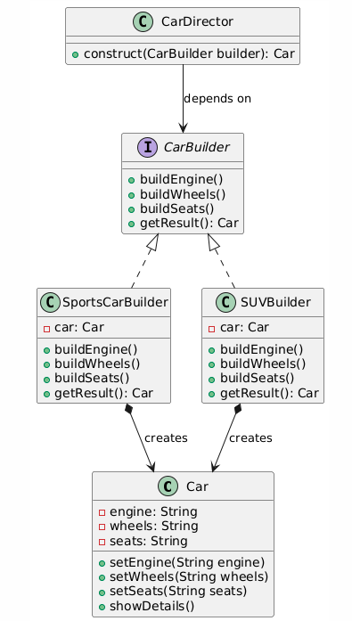

生成器模式

概念：将一个复杂对象的构建 与 表示进行分离，**使得复杂的构建过程可以创建不同的表示**

实现的目标：

1. 将复杂对象的**构建过程**与最终**表示形式**解耦
2. 使用相同的构建逻辑可以生成不同形态的对象

对目标的说明：

1. **构建过程**不是简单的赋值处理，而是分步骤对复杂对象各个组件进行组装完成一个完整对象的过程。

   比如说，我们需要一个Car对象，他的各个组件engine，wheels，seats不是简单的赋值，赋值逻辑比较复杂，那么我们可以将对象的构建拆解成多个独立方法buildEngine等方法，这些方法可以构建Car对象的不同属性。

   构建过程的步骤顺序由指挥者**Director**统一管理。

   所以我认为构建过程只是把对象的封装抽象出来，然后封装的具体方法执行顺序由指挥者管理

2. **最终表现形式**，由具体的生成器(Concrete Builder)实现，生成器就是要描述我们要生成的具体产品，其实就是给我们的产品开始赋值

3. 因为我们的生成器不同，生成器使用的构建逻辑是相同的，所以可以实现生成不同形态的对象。

~~~java
//================= 1. 产品类（Product） =================
class Car {
    private String engine;
    private String wheels;
    private String seats;

    public void setEngine(String engine) { this.engine = engine; }
    public void setWheels(String wheels) { this.wheels = wheels; }
    public void setSeats(String seats) { this.seats = seats; }

    public void showDetails() {
        System.out.println("Engine: " + engine);
        System.out.println("Wheels: " + wheels);
        System.out.println("Seats: " + seats);
    }
}

//================= 2. 抽象生成器接口（Builder） =================
interface CarBuilder {
    void buildEngine();
    void buildWheels();
    void buildSeats();
    Car getResult();
}

//================= 3. 具体生成器（Concrete Builder） =================
// 跑车生成器
class SportsCarBuilder implements CarBuilder {
    private Car car = new Car();

    public void buildEngine() { car.setEngine("V8 Turbo Engine"); }
    public void buildWheels() { car.setWheels("20-inch Sport Rims"); }
    public void buildSeats() { car.setSeats("Carbon Fiber Bucket Seats"); }
    public Car getResult() { return car; }
}

// SUV生成器
class SUVBuilder implements CarBuilder {
    private Car car = new Car();

    public void buildEngine() { car.setEngine("V6 EcoBoost Engine"); }
    public void buildWheels() { car.setWheels("18-inch All-Terrain Tires"); }
    public void buildSeats() { car.setSeats("Leather Heated Seats"); }
    public Car getResult() { return car; }
}

//================= 4. 指挥者类（Director） =================
class CarDirector {
    public Car construct(CarBuilder builder) {
        builder.buildEngine();
        builder.buildWheels();
        builder.buildSeats();
        return builder.getResult();
    }
}

//================= 5. 客户端代码 =================
public class Client {
    public static void main(String[] args) {
        CarDirector director = new CarDirector();

        // 构建跑车
        CarBuilder sportsBuilder = new SportsCarBuilder();
        Car sportsCar = director.construct(sportsBuilder);
        sportsCar.showDetails();

        // 构建SUV
        CarBuilder suvBuilder = new SUVBuilder();
        Car suv = director.construct(suvBuilder);
        suv.showDetails();
    }
}
~~~

